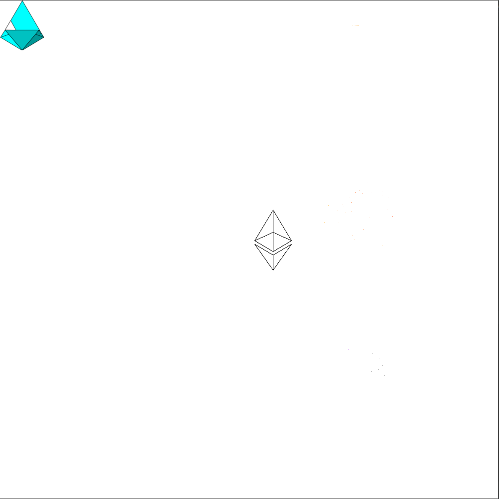

# Decentralized Graffiti Drawing

This generic tool helps you draw images on the beaconcha.in graffitiwall for 
[pyrmont](https://pyrmont.beaconcha.in/graffitiwall) or
[mainnet](https://beaconcha.in/graffitiwall). First, use the Viewer to generate a config
representing your image on the wall. Then share it with your friends and start drawing together!




## Requirements
You need python3 with some libraries. Install dependencies with `pip install -r requirements.txt`.


## Rocketpool users
While this tool can be used by any eth2 staker, I want to provide an easy solution for rocketpool beta
users. It will draw above situation (but on pyrmont).

1. **Running the script** \
   1.1 **Using docker** \
   If you want to integrate the process into rocketpools docker stack, this is for you: \
   1.1.1 Get the docker image
   - If you trust me, you can pull my image from dockerhub:
   `docker pull ramirond/graffiti && docker image tag ramirond/graffiti rocketpool/graffiti`
   - To create it yourself, run: `docker build -t rocketpool/graffiti .` (don't miss the `.`).
   
    1.1.2 Edit rocketpool's docker stack to also start your new container:
   `nano ~/.rocketpool/docker-compose.yml` \
   Insert this section as another service:
   ```
     graffiti:
       image: rocketpool/graffiti
       container_name: ${COMPOSE_PROJECT_NAME}_graffiti
       restart: unless-stopped
       volumes:
         - ./data:/data
       networks:
         - net
       command: "--network pyrmont --client $VALIDATOR_CLIENT --out-file /data/graffiti.txt --eth2-url eth2 --eth2-port 5052"
       depends_on:
         - eth2
   ```

   1.2 **Without Docker** \
   If you want to manually start the service and save some resources, you can also run the script
   alone. Here's how to do it using screen, but you could also use a system service for example.
   - Start the screen session: `screen -S graffiti`
   - Run: `python3 Drawer.py --network pyrmont --client <your client> --out-file ~/.rocketpool/data/graffiti.txt`

   1.3 **Nimbus users** \
   You will need the unstable version for now which is not officially built and released.
   Again, you can use one of my [docker images](https://hub.docker.com/repository/docker/ramirond/nimbus-eth2) or check
   out official documentation to build your own. Next, load your new unstable image:
   Edit `~/.rocketpool/config.yml` and select the new nimbus image
   (e.g. `image: ramirond/nimbus-eth2:arm64-unstable`). \
   For non-docker setups, you might want to use [my binaries](nimbus-unstable).
   

3. Advise your validator client to load the graffiti from the generated file.
   - Edit `.rocketpool/chains/eth2/start-validator.sh` with the flags explained [below](#Usage-1).
   - Or simply do:
   `cp rocketpool/start-validator.sh ~/.rocketpool/chains/eth2/start-validator.sh`
4. Restart your rocketpool service.

## Viewer
The viewer loads the current graffitiwall as well as an image. You can move it around or
scale it until you found your favorite spot. Once you're done, you can save your
desired configuration, so it can be picked up by the Drawer.
### Usage:
`python3 Viewer.py` \
You can move your image around using `wasd` and scale it with `+` and `-`
(using different interpolation methods, iterated by `i`). To hide your image behind already drawn
pixels, use `o` (shown below), `h` to hide it entirely. At any time you can print (to console)
the amount of pixels needed with `c`. To save your settings, press `f`. `Esc` or `q` to exit.

To use your own file instead, edit `settings.ini` accordingly.


## Drawer
This component performs the decentralized drawing. The script identifies invalid pixels
and fixes them. You can decide when to update the graffiti wall:
- **in defined intervals** (default) \
  This is easiest to set up (and implement). Just generate a new graffiti regularly, whether it'll be used or not.
  If you don't need to optimize performance, this should be fine.
- **only on block proposals** \
  Each epoch, the script checks which of your validators are chosen to propose a block. It's only updating pixel data
  if there's at least one proposal (which should rarely happen, unless you are running thousands of validators).
  Thus, this approach should save quite some resources. \
  You can
   - connect to the beaconcha.in api (default) **not yet implemented**
   - connect to your own eth2 node (preferred) **not yet implemented**
   - connect to an infura eth2 node **not yet implemented**

### Usage
Check out `python3 Drawer.py --help` for available parameters. You need to specify your client because
they each expect the graffiti file to be in a specific format. \
Example: `python3 Drawer.py --network pyrmont --client lighthouse --out-file /mnt/ssd/lighthouse/graffiti.txt`

Lighthouse, Teku and Prysm read the generated graffiti from a file.
Nimbus gets updated via RPC. Note that this is still an `unstable` feature
(if you don't want to build it yourself and you trust me, check out the binaries in 
[nimbus-unstable](nimbus-unstable)). \
Just let the script run in another process (using screen, for example).
Also don't forget restarting your eth2 validator client with the file specified / rpc enabled:
- [Lighthouse](https://lighthouse-book.sigmaprime.io/graffiti.html#1-using-the---graffiti-file-flag-on-the-validator-client):
  `lighthouse vc --graffiti-file /path/to/your/graffiti.txt`
- [Prysm](https://docs.prylabs.network/docs/prysm-usage/graffiti-file/): 
  `prysm.sh validator --graffiti-file=/path/to/your/graffiti.txt`
- [Teku](https://docs.teku.consensys.net/en/latest/Reference/CLI/CLI-Syntax/#validators-graffiti-file):
  `teku vc --validators-graffiti-file=/path/to/your/graffiti.txt`
- [Nimbus](https://nimbus.guide/api.html#introduction): `nimbus_beacon_node --rpc`
### Disclaimer
  In theory, it shouldn't be possible for this script to interrupt your staking performance,
but I won't promise that. Use at your own risk.