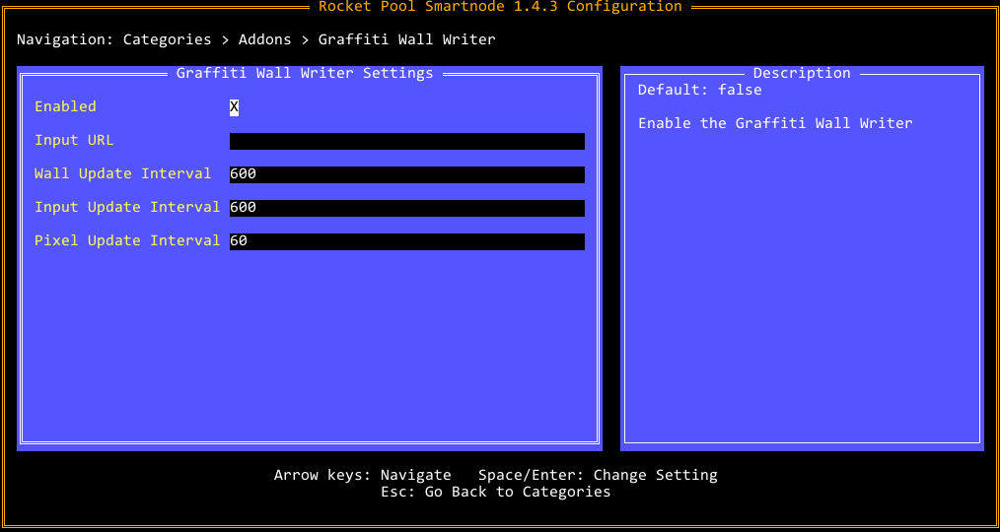

# Decentralized Graffiti Drawing

These tools help you draw images on the beaconcha.in graffitiwall
[beaconcha.in graffitiwall](https://beaconcha.in/graffitiwall).
First, use the Viewer to generate a config representing your image on the wall.
Then share it with your friends and start drawing together!

## Requirements
For the viewer you need python3 with some libraries.
Install dependencies with `pip install -r requirements.txt`.

For the new golang version of the drawer there are no additional dependencies.

## Rocketpool users
While this tool can be used by any eth2 staker, here is an easy solution for rocketpool users. The first image we decided to draw is the Rocket Pool logo.
By following the instructions you can help drawing! Once we're done there will be a new image.

Starting from version v1.6.0 this drawer has been included as official Rocket Pool addon!
Enabling it is easy:
```
  rpl@pi4:~$ rocketpool service config
  -> Addons
  -> Graffiti Wall Writer
  -> check the Enabled box
  -> save config and (re)start service
```




## Viewer
The viewer loads the current graffitiwall as well as an image. Check out `settings.ini` to specify details. You can move it around or scale it until you found your favorite spot. Optionally you can also define the priority of each pixel. Once you're done, you can export your desired configuration, so it can be picked up by the Drawer in the next step.
### Usage:
`python3 Viewer.py` \
You can move, scale, hide etc. your image. Press `h` while the viewer window is active to show all options. Once you are happy, press `e` to generate your `graffiti.json`. This will be used by the drawer in the next step.


## Drawer
This component performs the decentralized drawing. The program identifies invalid pixels
and fixes them. It checks all relevant data in defined intervals.
The newest iteration of our drawer uses a json input file (or URL) as generated by the Viewer.
Our rocketpool logo input file has been included [in this repo](rocketpool/graffiti.json "Rocketpool Logo graffiti input").
Note that white pixels will be skipped unless they need to be fixed.

### Usage
Check out `./drawer -help` for available parameters. You need to specify your client because
they each expect the graffiti file to be in a specific format. \
Example: `drawer -network mainnet -consensus_client=lighthouse -out-file /mnt/ssd/lighthouse/graffiti.txt -input-url=../rocketpool/graffiti.json`

Lighthouse, Teku and Prysm read the generated graffiti from a file.
Nimbus gets updated [via REST API](https://nimbus.guide/rest-api.html#set-graffiti-string).\
Just let the program run in another process (using screen, or docker for example).
Also don't forget restarting your eth2 validator client with the graffiti file specified / REST api enabled:
- [Lighthouse](https://lighthouse-book.sigmaprime.io/graffiti.html#1-using-the---graffiti-file-flag-on-the-validator-client):
  `lighthouse vc --graffiti-file /path/to/your/graffiti.txt`
- [Prysm](https://docs.prylabs.network/docs/prysm-usage/graffiti-file/):
  `prysm.sh validator --graffiti-file=/path/to/your/graffiti.txt`
- [Teku](https://docs.teku.consensys.net/en/latest/Reference/CLI/CLI-Syntax/#validators-graffiti-file):
  `teku vc --validators-graffiti-file=/path/to/your/graffiti.txt`
- [Nimbus](https://nimbus.guide/rest-api.html#configure-your-node-to-run-a-local-rest-server): `nimbus_beacon_node --rest`
NOTE: Certain clients (e.g. lighthouse) will refuse to run if the graffiti-file does not exist!

The drawer also generates prometheus statistics that will be enabled by default on port 9106.
In case this is undesired you can disable this with `-metrics_enabled=false`.
These metrics will give an indication of pixel drawing speed and how much work is left, along with generic golang stats.

## Disclaimer
In theory, these tools won't affect your staking performance, but the authors make no promises.
Using these tools is at your own risk.


